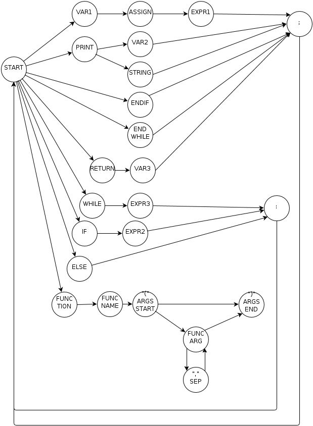

Синтаксический анализатор
======================================

Модуль принимает как исходные данные результат лексического анализа, список лексем. Цель последующей обработки - построение синтаксического дерева.

Анализ делается при помощи двух машин, которые строят дерево:
   #) Основная машина для обработки управляющих конструкций и операций языка
   #) Машина, отвечающая за обработку выражений

Переключение между машинами происходит автоматически, опираясь на машину состояний.

Состояния EXPR* являются состояниями, в которых включается вторая машина. При встрече лексемы, не принадлежащей к выражению машина возвращает управление основной.

Использование машин не только позволяет упростить синтаксический анализ, зная какие лексемы ожидаются и какой тип выражения разбирается в данный момент намного раньше, чем это было бы без машины, это также помогает выявлять синтаксические ошибки очень рано.

Основная машина
------------------------------------
Машина работает строго по состояниям, диаграмма которых изображена выше.
Используется так же стековая система, позволяющая отложить обработку некоторых лексем до окончательного определения типа выражения и сбора всех данных для добавления узла в дерево.

Также проводит анализ синтаксических ошибок, прерывая работу и указывая на строку с ошибкой при обнаружении.

Машина выражений
------------------------------------
Стековая машина, работающая по принципу преобразования инфиксного выражения в постфиксное (польская нотация), при этом на выходе не постфиксная запись в строку, а дерево выражения с математическими операциями и операндами в узлах.

Пример
^^^^^^^^^^^^^^^^^^^^^^^^^^^^^^^^^^^^
Выражение::

(15-2)-5

преобразуется в такое дерево::

-- '-', 
------ '-', 
---------- '15',
---------- '2'
------ '5'

Выражение::

 j+2 >= 10

В такое дерево::

-- '>=', 
------ '+', 
---------- 'j', 
---------- '2'
------ '10'

Коммуникация между машинами
------------------------------------
Используется глобальный стек, который доступен обоим машинам, так что разобранные выражения передаются из второй машины в первую через него, так как окончательные узлы в дерево добавляет именно первая машина. Выражения же являются лишь частями более крупных конструкций, таких как присваивание, ветвление и условия выхода в циклах.